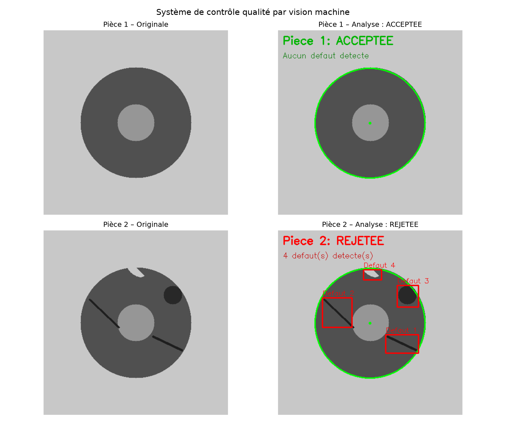

# Machine Vision Quality Control Simulator

Par Nicolas Desnoyers

Simulateur de contrôle qualité par vision machine, développé en Python avec OpenCV.
Conçu pour démontrer les principes de base de l'inspection automatisée de pièces industrielles.

## Description

Ce projet simule un système de vision machine capable de détecter des défauts sur des
CD sur une ligne de production. Le système génère des pièces de test synthétiques et applique 
des algorithmes de traitement d'image pour identifier automatiquement les anomalies.

## Défauts détectés

- des rayures (les deux lignes noires)
- Une tache (le cercle noir)
- un bout brisé (la zone claire sur le bord)

## Technologies utilisées

- Python 3.x
- OpenCV (cv2) — traitement d'image et détection de contours
- NumPy — manipulation de matrices
- Matplotlib — visualisation des résultats

## Installation

```bash
pip install opencv-python numpy matplotlib
```

## Utilisation

```bash
python main.py
```

Le programme génère automatiquement deux pièces de test (une sans défaut, une avec
défauts), analyse chacune et sauvegarde les résultats dans le dossier `images/`.

## Algorithme de détection

1. Détection de la pièce principale par la fonction HoughCircles
2. Création d'un masque excluant le trou central et le fond
3. Calcul de la valeur moyenne de gris sur la surface de la pièce
4. Seuillage adaptatif pour détecter les zones anormalement sombres (rayures, taches)
   et claires (ébréchures)
5. Dilatation morphologique pour fusionner les contours proches
6. Classification : ACCEPTEE si aucun défaut, REJETEE sinon

## Résultats



## Auteur

Nicolas Desnoyers — Étudiant en génie physique, Polytechnique Montréal  
[GitHub](https://github.com/73629)